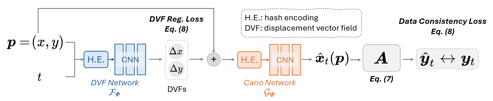

### MoCo-INR


This is the official code repository of our work "**Unsupervised Motion-Compensated Decomposition for Cardiac MRI
Reconstruction via Neural Representation**" accepcted by AAAI 2026. [[ArXiv]](https://arxiv.org/abs/2511.11436) 

---

### Overview

*Figure 1. Pipeline of MoCo-INR*.


### Results


*Figure 2. Qualitative and quantitative comparison with MoCo-INR on the SAX view using the VISTA sampling pattern (AF=20)*.


*Figure 3. Qualitative and quantitative comparison with MoCo-INR on the SAX view using the Golden-Angle Radial sampling (#spoke/frame=3)*.


*Figure 4. Qualitative comparison with MoCo-INR on free-breathing scans*.


### Run Recon Demos

We provide recon demo to demonstrate how MoCo-INR works. 
- `train_VISTA.py` shows the reconstruction workflow of VISTA sampling pattern
- `train_GA.py` shows the reconstruction workflow of Golden-Angle Radial sampling pattern
- `train_FB_real.py` shows the reconstruction workflow of free-breathing scans

### File Tree

``` bash
MoCo-INR/
├── Config/
│   ├── FB_real_recon.json      # Configuration for FB real-data reconstruction
│   ├── GA_recon.json           # Configuration for Golden-Angle sampling experiments
│   └── VISTA_recon.json        # Configuration for VISTA dataset reconstruction
│
├── Data/
│   ├── FB_real/                # Real FB dataset (raw / preprocessed data)
│   ├── LAX/                    # Long-axis cardiac data
│   └── SAX/                    # Short-axis cardiac data
│
├── Fig/                        # Figures for visualization and analysis
│
├── src/
│   ├── loss.py                 # Loss functions (data fidelity, regularization, etc.)
│   ├── model.py                # MoCo-INR model definitions
│   └── utils.py                # Utility functions (FFT, metrics, helpers)
│
├── train_FB_real.py            # Training / reconstruction script for FB real data
├── train_GA.py                 # Training script for Golden-Angle experiments
├── train_VISTA.py              # Training script for VISTA dataset
│
└── README.md                   # Project documentation

```

### Citation

```
@article{tian2025unsupervised,
  title={Unsupervised Motion-Compensated Decomposition for Cardiac MRI Reconstruction via Neural Representation},
  author={Tian, Xuanyu and Chen, Lixuan and Wu, Qing and Wang, Xiao and Feng, Jie and Zhang, Yuyao and Wei, Hongjiang},
  journal={arXiv preprint arXiv:2511.11436},
  year={2025}
}
```